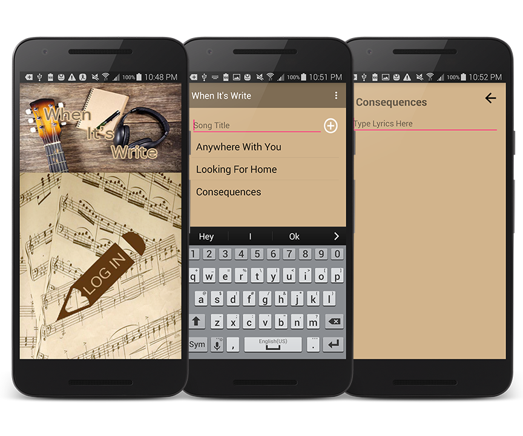

# WhenItsWrite
Google Play link:
https://play.google.com/store/apps/details?id=com.austinjones.whenitswrite

When It's Write is an app that allows musicians to write and store lyrics while they are one the go.

It uses the Firebase database to store the lyrics in an online database that can be accessed from anywhere.
It uses Facebook for authentication.

The approach I took in my design is to make something that I would want to use. I made something that was aesthetically pleasing and intuitive.

This app is designed for musicians but can also be used for many other purposes such as note taking.

There are many features that I wanted to include but they did not fit the time frame for this release.
